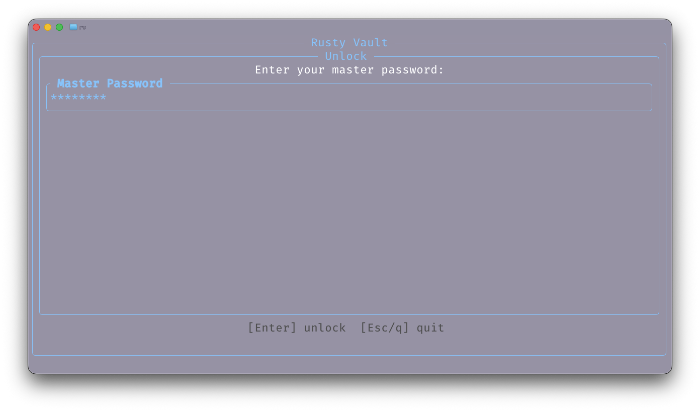
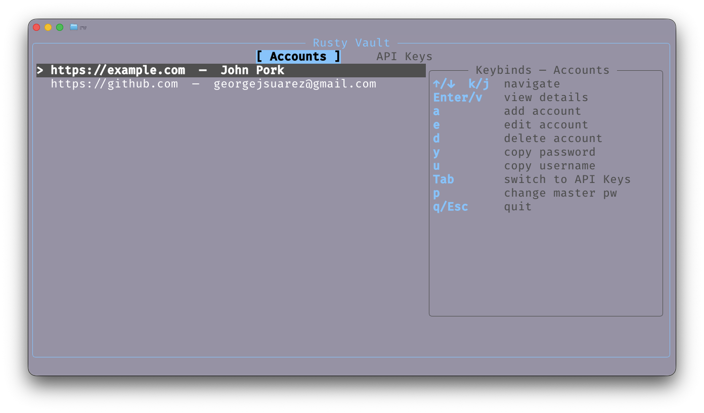
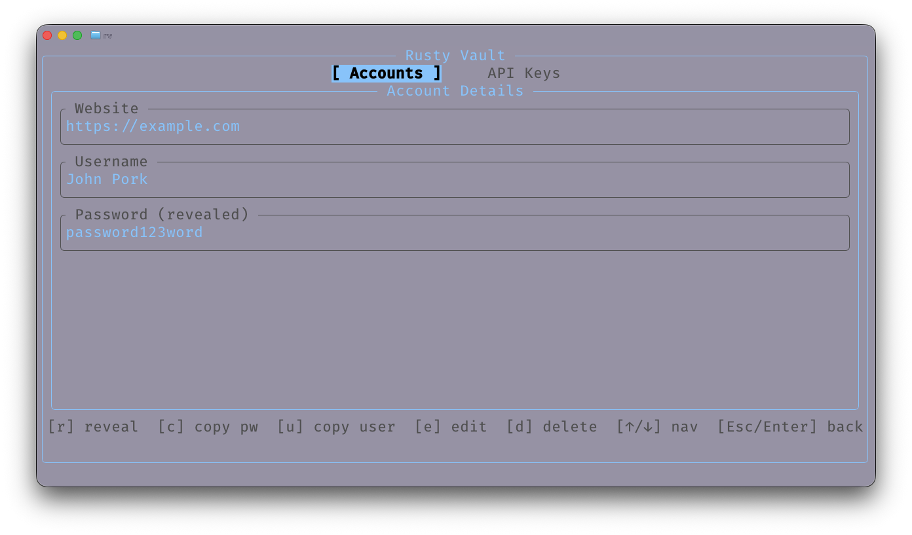
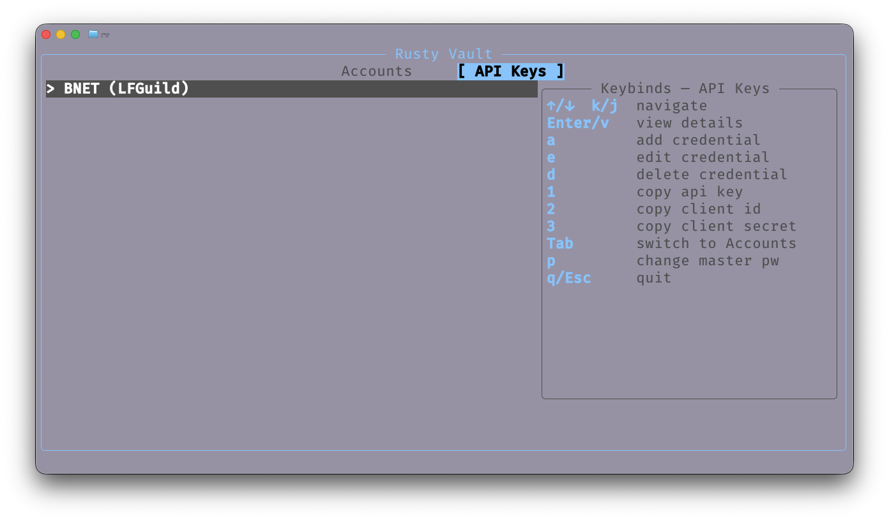
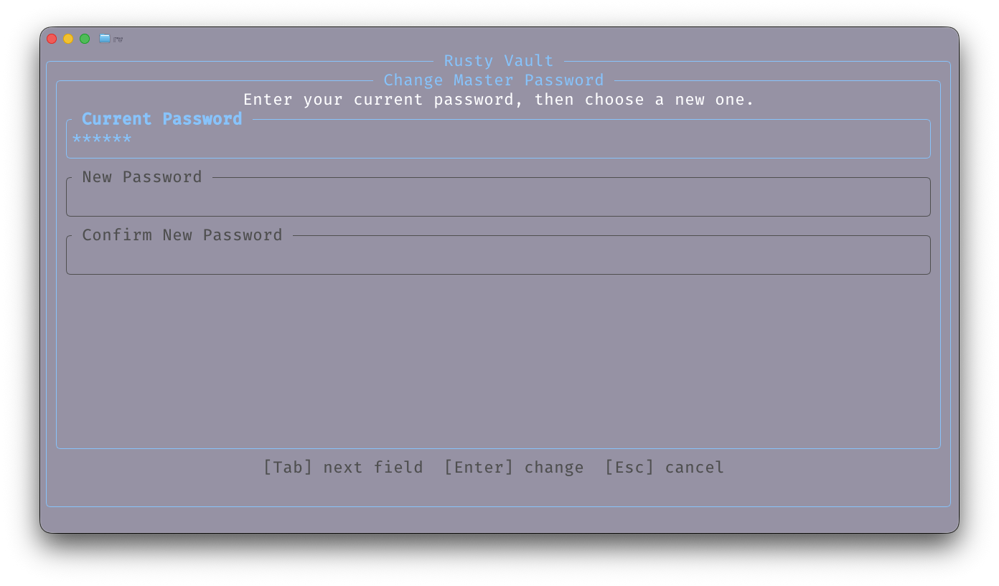

# Rusty Vault

Manage your passwords and api credentials from your terminal powered by Rust and Ratatui.

## Key features

- **Encrypted storage** — Passwords, API keys, and client secrets are encrypted
  with AES-256-GCM before being written to a local SQLite database. The master
  key is derived via Argon2id (memory-hard) from your master password and a
  per-vault random salt.
- **Two workflows** —
  - **Accounts:** website / username / password entries.
  - **API Keys:** name / api key / client id / client secret. Only `name` is
    required; the rest are optional so you can store just what you need.
- **Master password protection** — The vault is unlocked with a master
  password. A verifier lets the app confirm the password without storing it.
- **Change master password** — Re-encrypts every secret with the new key in a
  single atomic transaction. Requires the old password.
- **Clipboard copy** — Copy usernames, passwords, API keys, client IDs, and
  client secrets to the system clipboard without revealing them on screen.
- **On-demand reveal** — View a decrypted secret in the detail view; press `r`
  again to re-hide. Navigating away auto-hides it.
- **Memory hardening** — Sensitive in-memory buffers (master key, decrypted
  secrets, form inputs) are scrubbed with [`zeroize`](https://crates.io/crates/zeroize)
  on lock, quit, drop, and at every scrub point in the app lifecycle.
- **Tabbed TUI** — Switch between the Accounts and API Keys workflows with a
  persistent tab bar. A keybinds panel is shown next to the list for quick
  reference.
- **No network** — Everything runs locally. The database file (`rusty-vault.db`)
  lives in your working directory.

## Installing

### From source

Requires Rust 1.75+ (uses the 2024 edition).

```bash
git clone https://github.com/GeorgeSuarez/RustyVault.git
cd rusty-vault
cargo build --release
```

The binary will be at `target/release/rusty-vault`. Copy it anywhere in your
`$PATH`:

```bash
cp target/release/rusty-vault /usr/local/bin/
```

### Requirements

- SQLite is bundled via `rusqlite`'s `bundled` feature, so no system SQLite is
  required.
- The clipboard copy feature uses `arboard`, which works on macOS, Windows, and
  Linux (X11/Wayland).

## Usage

Run the program from a directory where you want the vault database to live:

```bash
rusty-vault
```

### First run — create the vault

On first launch you'll see the **Create Vault** screen. Type a master password,
confirm it, and press `Enter`. The vault is created in `rusty-vault.db` in the
current directory.

> Choose a strong master password. There is no recovery mechanism — if you
> forget it, the encrypted data is unrecoverable by design.

### Subsequent runs — unlock

Each launch shows the **Unlock** screen. Enter your master password and press
`Enter` to decrypt the vault.

### The list view

After unlock you'll see the **Accounts** list with a tab bar at the top and a
keybinds panel on the right. Press `Tab` to switch to the **API Keys** workflow.

### Keybindings

#### List view (Accounts)

| Key           | Action                  |
| ------------- | ----------------------- |
| `↑` / `k`     | Move selection up       |
| `↓` / `j`     | Move selection down     |
| `Enter` / `v` | Open detail view        |
| `a`           | Add account             |
| `e`           | Edit selected account   |
| `d`           | Delete selected account |
| `y`           | Copy password           |
| `u`           | Copy username           |
| `Tab`         | Switch to API Keys      |
| `p`           | Change master password  |
| `q` / `Esc`   | Quit                    |

#### List view (API Keys)

| Key           | Action                     |
| ------------- | -------------------------- |
| `↑` / `k`     | Move selection up          |
| `↓` / `j`     | Move selection down        |
| `Enter` / `v` | Open detail view           |
| `a`           | Add API credential         |
| `e`           | Edit selected credential   |
| `d`           | Delete selected credential |
| `1`           | Copy API key               |
| `2`           | Copy client ID             |
| `3`           | Copy client secret         |
| `Tab`         | Switch to Accounts         |
| `p`           | Change master password     |
| `q` / `Esc`   | Quit                       |

#### Detail view

| Key                   | Action                        |
| --------------------- | ----------------------------- |
| `r`                   | Reveal / hide secrets         |
| `c`                   | Copy password (Accounts)      |
| `u`                   | Copy username (Accounts)      |
| `1`                   | Copy API key (API Keys)       |
| `2`                   | Copy client ID (API Keys)     |
| `3`                   | Copy client secret (API Keys) |
| `e`                   | Edit this entry               |
| `d`                   | Delete this entry             |
| `↑` / `k`             | Previous entry                |
| `↓` / `j`             | Next entry                    |
| `Esc` / `Enter` / `q` | Back to list                  |

#### Add / Edit form

| Key         | Action           |
| ----------- | ---------------- |
| `Tab`       | Next field       |
| `Shift+Tab` | Previous field   |
| `Backspace` | Delete last char |
| `Enter`     | Save             |
| `Esc`       | Cancel           |

#### Change master password

| Key         | Action         |
| ----------- | -------------- |
| `Tab`       | Next field     |
| `Shift+Tab` | Previous field |
| `Enter`     | Submit change  |
| `Esc`       | Cancel         |

#### Global

| Key      | Action |
| -------- | ------ |
| `Ctrl+C` | Quit   |

## Security notes

- The master key lives only in process memory while the vault is unlocked and
  is zeroized on quit, lock, and drop.
- Secrets copied to the clipboard are **not** automatically cleared — the OS
  clipboard retains them until replaced. Consider clearing your clipboard
  manually after pasting.
- The database file (`rusty-vault.db`) contains the Argon2id salt, an encrypted
  verifier, and the encrypted secrets. It is safe to back up, but keep it
  private — a brute-force attack against a weak master password is the main
  risk.
- Argon2 uses default parameters (m=19456 KiB, t=2, p=1). Tuning these for
  production use is recommended.

## Screen Shots

### Master password view



### Account list view



### Account details view



### API keys view



### Change password view



## License

MIT
