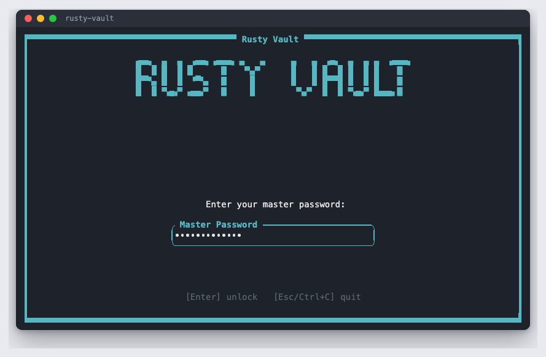
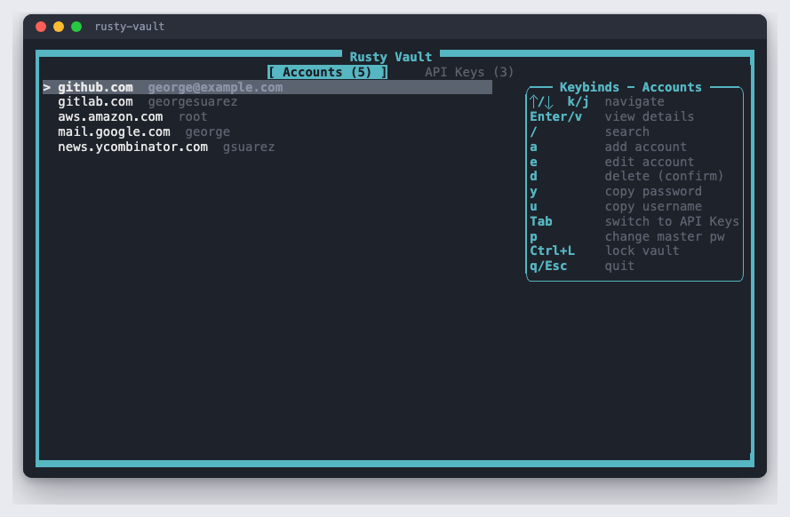
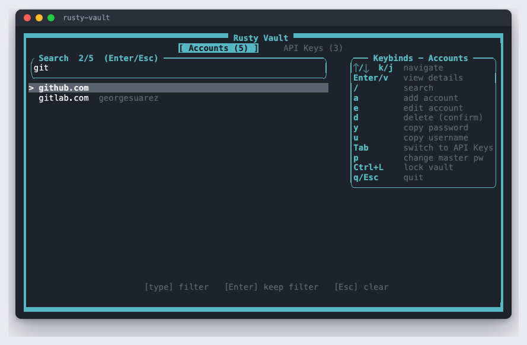
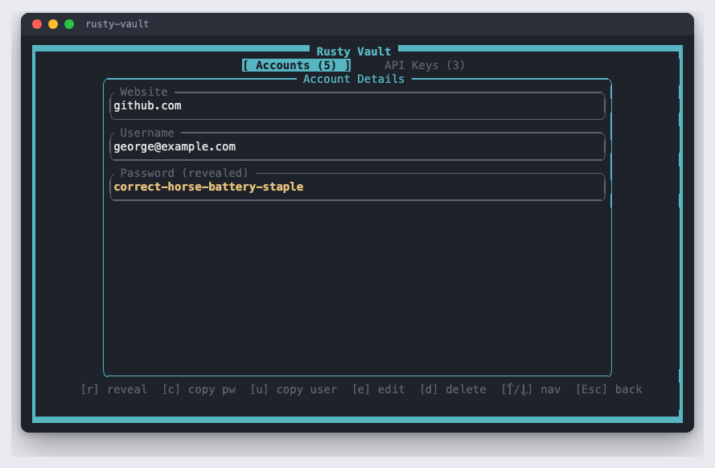
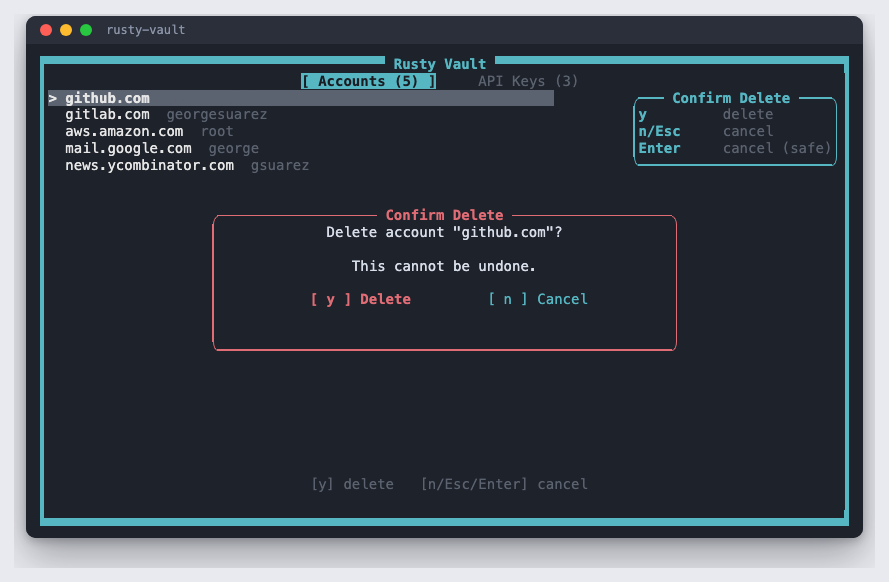
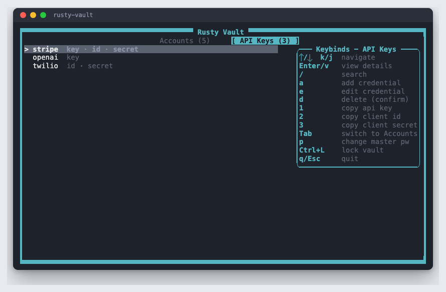
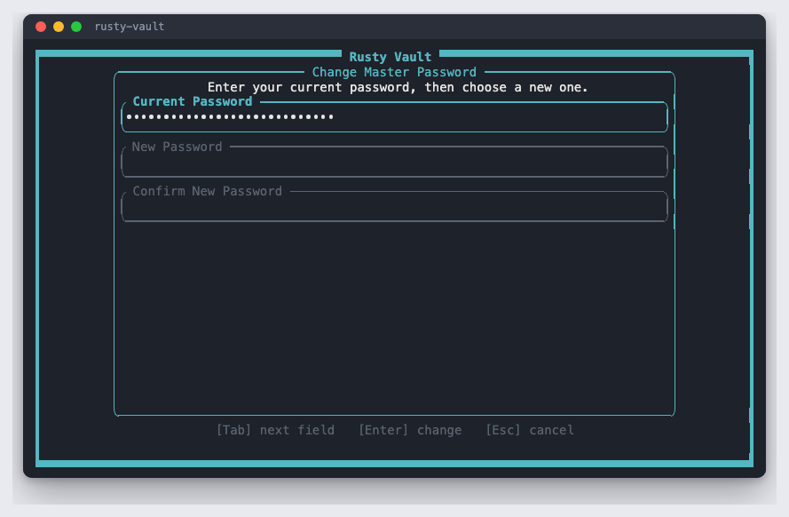

# Rusty Vault

Manage your passwords and api credentials from your terminal powered by Rust and Ratatui.

## Key features

- **Encrypted storage** — Passwords, API keys, and client secrets are encrypted
  with AES-256-GCM before being written to a local SQLite database. The master
  key is derived via Argon2id (memory-hard) from your master password and a
  per-vault random salt.
- **Two workflows** —
  - **Accounts:** website / username / password entries.
  - **API Keys:** name / api key / client id / client secret. Only `name` is
    required; the rest are optional so you can store just what you need.
- **Master password protection** — The vault is unlocked with a master
  password. A verifier lets the app confirm the password without storing it.
- **Change master password** — Re-encrypts every secret with the new key in a
  single atomic transaction. Requires the old password.
- **Clipboard copy** — Copy usernames, passwords, API keys, client IDs, and
  client secrets to the system clipboard without revealing them on screen.
- **On-demand reveal** — View a decrypted secret in the detail view; press `r`
  again to re-hide. Navigating away auto-hides it.
- **Delete confirmation** — Destructive actions require an explicit `y`.
- **Search / filter** — Press `/` in a list to filter by site, username, name,
  or client id.
- **Password generator** — Press `Ctrl+G` in a form to fill the focused secret
  field with a random 20-character password.
- **Auto-lock** — The vault locks after 5 minutes without input (configurable),
  or immediately with `Ctrl+L`.
- **Clipboard auto-clear** — Copied secrets are cleared from the clipboard
  after 30 seconds, but only if the clipboard still holds them.
- **Memory hardening** — Sensitive in-memory buffers (master key, decrypted
  secrets, form inputs) are scrubbed with [`zeroize`](https://crates.io/crates/zeroize)
  on lock, quit, drop, and at every scrub point in the app lifecycle.
- **Tabbed TUI** — Switch between the Accounts and API Keys workflows with a
  persistent tab bar. A keybinds panel is shown next to the list for quick
  reference.
- **No network** — Everything runs locally. The database file defaults to
  `rusty-vault.db` in the working directory and can be relocated with
  `--db <PATH>` or `RUSTY_VAULT_DB`.

## Installing

### From source

Requires Rust 1.85+ (edition 2024).

```bash
git clone https://github.com/GeorgeSuarez/RustyVault.git
cd rusty-vault
cargo build --release
```

The binary will be at `target/release/rusty-vault`. Copy it anywhere in your
`$PATH`:

```bash
cp target/release/rusty-vault /usr/local/bin/
```

### Requirements

- SQLite is bundled via `rusqlite`'s `bundled` feature, so no system SQLite is
  required.
- The clipboard copy feature uses `arboard`, which works on macOS, Windows, and
  Linux (X11/Wayland).

## Usage

Run the program with no arguments to use `rusty-vault.db` in the current
directory, or point it at an explicit location:

```bash
rusty-vault --db ~/.local/share/rusty-vault/vault.db
```

| Option | Description |
| ------ | ----------- |
| `-d`, `--db <PATH>` | Vault database file (default: `rusty-vault.db`) |
| `--idle-lock-secs <SECS>` | Auto-lock after inactivity; `0` disables (default: `300`) |
| `-h`, `--help` | Print usage |
| `-V`, `--version` | Print the version |

Environment variables: `RUSTY_VAULT_DB` sets the default database path and
`RUSTY_VAULT_IDLE_LOCK_SECS` the idle-lock timeout. The database file is
created with owner-only permissions (`0600`) on Unix.

### First run — create the vault

On first launch you'll see the **Create Vault** screen. Type a master password,
confirm it, and press `Enter`. The vault is created in `rusty-vault.db` in the
current directory.

> Choose a strong master password (at least 8 characters). There is no
> recovery mechanism — if you forget it, the encrypted data is unrecoverable
> by design.

### Subsequent runs — unlock

Each launch shows the **Unlock** screen. Enter your master password and press
`Enter` to decrypt the vault.

### The list view

After unlock you'll see the **Accounts** list with a tab bar at the top and a
keybinds panel on the right. Press `Tab` to switch to the **API Keys** workflow.

### Keybindings

#### List view (Accounts)

| Key           | Action                             |
| ------------- | ---------------------------------- |
| `↑` / `k`     | Move selection up                  |
| `↓` / `j`     | Move selection down                |
| `Enter` / `v` | Open detail view                   |
| `/`           | Search / filter                    |
| `a`           | Add account                        |
| `e`           | Edit selected account              |
| `d`           | Delete selected account (confirms) |
| `y`           | Copy password                      |
| `u`           | Copy username                      |
| `Tab`         | Switch to API Keys                 |
| `p`           | Change master password             |
| `Ctrl+L`      | Lock vault                         |
| `q` / `Esc`   | Quit                               |

#### List view (API Keys)

| Key           | Action                                |
| ------------- | ------------------------------------- |
| `↑` / `k`     | Move selection up                     |
| `↓` / `j`     | Move selection down                   |
| `Enter` / `v` | Open detail view                      |
| `/`           | Search / filter                       |
| `a`           | Add API credential                    |
| `e`           | Edit selected credential              |
| `d`           | Delete selected credential (confirms) |
| `1`           | Copy API key                          |
| `2`           | Copy client ID                        |
| `3`           | Copy client secret                    |
| `Tab`         | Switch to Accounts                    |
| `p`           | Change master password                |
| `Ctrl+L`      | Lock vault                            |
| `q` / `Esc`   | Quit                                  |

#### Detail view

| Key                   | Action                        |
| --------------------- | ----------------------------- |
| `r`                   | Reveal / hide secrets         |
| `c`                   | Copy password (Accounts)      |
| `u`                   | Copy username (Accounts)      |
| `1`                   | Copy API key (API Keys)       |
| `2`                   | Copy client ID (API Keys)     |
| `3`                   | Copy client secret (API Keys) |
| `e`                   | Edit this entry               |
| `d`                   | Delete this entry (confirms)  |
| `↑` / `k`             | Previous entry                |
| `↓` / `j`             | Next entry                    |
| `Esc` / `Enter` / `q` | Back to list                  |

#### Add / Edit form

| Key          | Action                        |
| ------------ | ----------------------------- |
| `Tab`        | Next field                    |
| `Shift+Tab`  | Previous field                |
| `←` / `→`    | Move caret                    |
| `Home`/`End` | Start / end of field          |
| `Ctrl+G`     | Generate password             |
| `Ctrl+U`     | Clear field                   |
| `Ctrl+W`     | Delete word before caret      |
| `Backspace`  | Delete character before caret |
| `Delete`     | Delete character at caret     |
| `Enter`      | Save                          |
| `Esc`        | Cancel                        |

> The unlock, create-vault, and change-master-password screens support the
> same caret and editing keys.

#### Confirm delete

| Key                   | Action         |
| --------------------- | -------------- |
| `y`                   | Confirm delete |
| `n` / `Esc` / `Enter` | Cancel         |

#### Change master password

| Key         | Action         |
| ----------- | -------------- |
| `Tab`       | Next field     |
| `Shift+Tab` | Previous field |
| `Enter`     | Submit change  |
| `Esc`       | Cancel         |

#### Global

| Key      | Action     |
| -------- | ---------- |
| `Ctrl+C` | Quit       |
| `Ctrl+L` | Lock vault |

## Security notes

- The master key lives only in process memory while the vault is unlocked and
  is zeroized on quit, lock, and drop.
- Secrets copied to the clipboard are cleared automatically after 30 seconds
  if the clipboard still holds them. Your OS or clipboard manager may keep its
  own history, so treat copied secrets as exposed.
- The database file is created with owner-only permissions (`0600`) on Unix,
  and existing files are tightened when opened.
- Deleted rows are overwritten inside the database file (`PRAGMA
  secure_delete`), so deletes and master-password changes do not leave old
  ciphertext in free pages.
- The database file (`rusty-vault.db`) contains the Argon2id salt, an encrypted
  verifier, and the encrypted secrets. It is safe to back up, but keep it
  private — a brute-force attack against a weak master password is the main
  risk.
- New vaults use Argon2id with m=19456 KiB, t=2, p=1. The cost parameters are
  persisted per vault, so existing vaults keep unlocking even if the defaults
  change in a later release.

## Screen Shots

### Master password view



### Account list view



### Search / filter



### Account details view



### Confirm delete



### API keys view



### Change password view



## License

MIT
